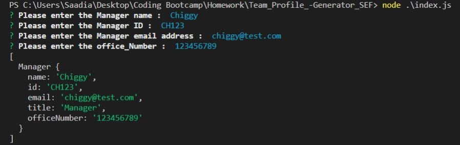
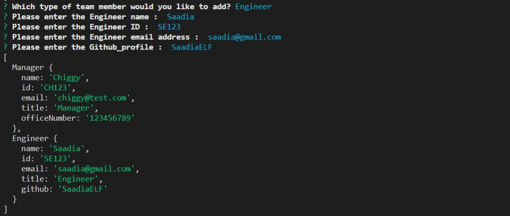
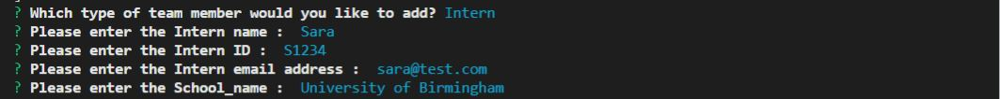
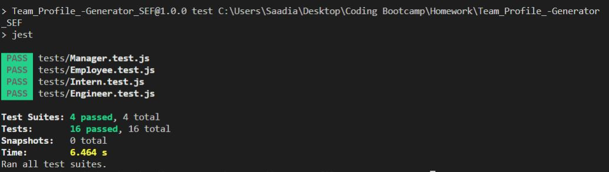

# Team_Profile_Generator_SEF 
-----------------------------------------------------------------------------------------------------------------------
Table of content :

* [Purpose](#Purpose)
* [Method](#Method)
* [Node.js](#Nodejs)
* [JavaScript](#JavaScript) 
* [Tests](#Tests) 
* [Demonstration](#Demonstration)
* [URLs](#URLs) 

-----------------------------------------------------------------------------------------------------------------------

## Purpose

The main purpose of this project is create a command-line application that takes in information about employees on a software engineering team, then generates an HTML webpage that displays summaries for each person.  

-----------------------------------------------------------------------------------------------------------------------

## Method

This application is created using the following languages, libraries and software.

    * Node.js
    * Javascript 
    * VS Code
    * Github
   
-----------------------------------------------------------------------------------------------------------------------

## Nodejs
    
This open-source back-end JavaScript runtime environment is used to invoke the teamProfile and style files using the following commands :

    * npm init -y : to intialise node
    * nmp i inquirer : to install the inquirer package
    * node index.js : to invoke the application (starts a serie of prompts)
-----------------------------------------------------------------------------------------------------------------------

## JavaScript 

This programming language is used to create :

* index.js : holds the application 
* lib :  folder that holds Employee class file (Employee.js) and the other three classes files that extend Employee (Manager.js, Engineer.js, Intern.js)
* tests : folder that holds file tests for classes (Employee.test.js, Manager.test.js, Engineer.test.js, Intern.test.js)

-----------------------------------------------------------------------------------------------------------------------

## Tests 

Tests carried by jest, to run the test you must follow those steps :

* nmp i jest -D : to install jest dependency in devDependencies
* npm run test :  to rum the tests
* All tests must be passed : 4 test suites and 16 tests.

-----------------------------------------------------------------------------------------------------------------------

## Demonstration

* Screenshots for the application:

* Screenshots for the tests:

* Walkthrough videos:

    - Application : (https://drive.google.com/file/d/1b4JL4xYMBtkXdRifreP8W9awr4THQJQ2/view?usp=sharing)  
    - Deployed in the browser : (https://drive.google.com/file/d/13BQSLkId_28QLSx4-L5pa7IMhBXkdRwY/view?usp=sharing)  
    - Test : (https://drive.google.com/file/d/1RwNXQDlmBJC8nwrvrw_HN6SCp57P0het/view?usp=sharing)
-----------------------------------------------------------------------------------------------------------------------

## URLs

The URL of the GitHub repository: https://github.com/SaadiaELF/Team_Profile_-Generator_SEF.git

-----------------------------------------------------------------------------------------------------------------------
